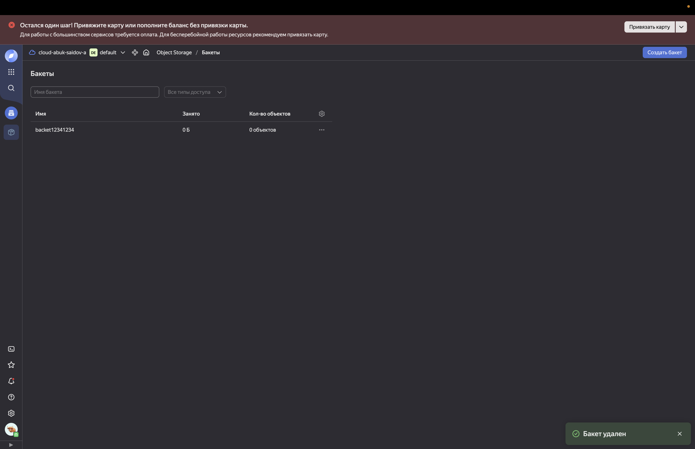

Результат создания s3 бакета с помощью terraform манифеста:

```terraform show                                                                                  (base) 

# yandex_iam_service_account.s3_sa:
resource "yandex_iam_service_account" "s3_sa" {
    created_at  = "2025-05-22T21:02:10Z"
    description = "Service account for S3 bucket management"
    folder_id   = "b1g8aotm4aajotaa73co"
    id          = "ajergb06ud91n3539j50"
    name        = "s3-service-account"
}

# yandex_iam_service_account_static_access_key.sa_keys:
resource "yandex_iam_service_account_static_access_key" "sa_keys" {
    access_key         = "YCAJETXPDv01wgu8jpb6o2G_I"
    created_at         = "2025-05-22T21:02:11Z"
    id                 = "ajer39bk1t03olhq0gjo"
    secret_key         = (sensitive value)
    service_account_id = "ajergb06ud91n3539j50"
}

# yandex_resourcemanager_folder_iam_member.sa_editor:
resource "yandex_resourcemanager_folder_iam_member" "sa_editor" {
    folder_id = (sensitive value)
    id        = "b1g8aotm4aajotaa73co/storage.editor/serviceAccount:ajergb06ud91n3539j50"
    member    = "serviceAccount:ajergb06ud91n3539j50"
    role      = "storage.editor"
}

# yandex_storage_bucket.s3_bucket:
resource "yandex_storage_bucket" "s3_bucket" {
    access_key            = "YCAJETXPDv01wgu8jpb6o2G_I"
    acl                   = "private"
    bucket                = "backet12341234"
    bucket_domain_name    = "backet12341234.storage.yandexcloud.net"
    default_storage_class = "STANDARD"
    folder_id             = "b1g8aotm4aajotaa73co"
    force_destroy         = false
    id                    = "backet12341234"
    max_size              = 0
    secret_key            = (sensitive value)

    anonymous_access_flags {
        config_read = false
        list        = false
        read        = false
    }

    versioning {
        enabled = false
    }
}


Outputs:

access_key = (sensitive value)
bucket_name = "backet12341234"
secret_key = (sensitive value)```
